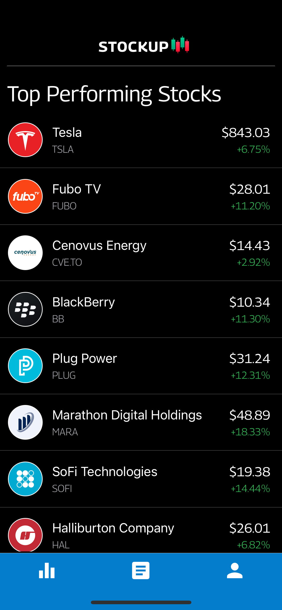
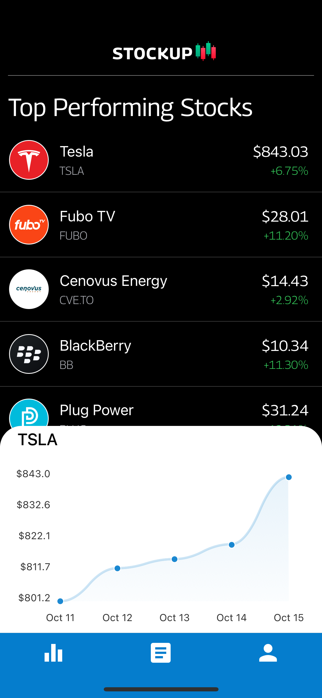
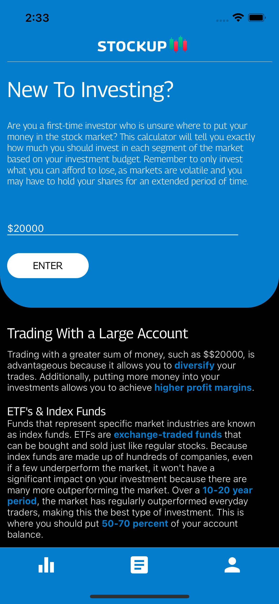

# StockUp
This app is built for beginner investors wanting to get started in the stock market. It features a list of top performing stocks from the current week on the home page and gives and explanation & chart when clicked on. The chart is displayed using an external library called 'react-native-charts'. The second page is a newsroom where investors can build their knowledge. The last page is a calculator that has the user input their investment budget and renders out information on where they should invest their money in the market.

  
  
^ Click to see demo ^

  
  
  
  
  

